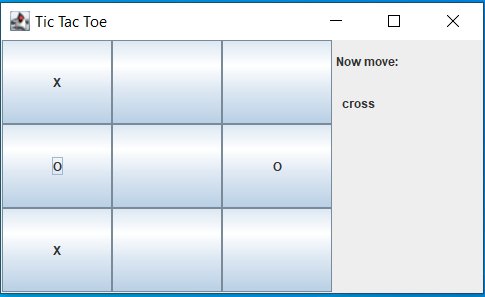
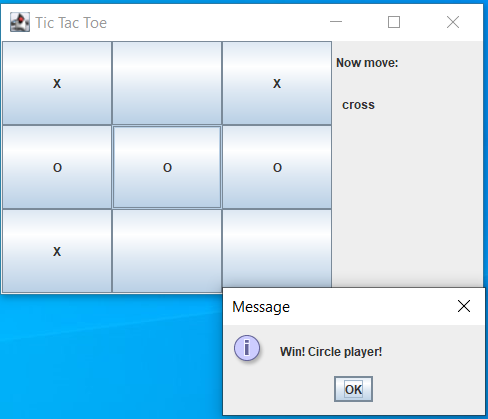

# Tic Tac Toe

## General Information
Inspired by popular game - Tic Tac Toe.

A strategy game played by two players.
The object of the game is to mark three of your own characters on a column, row or diagonal.

## Screenshots
### Board with fields

### Game won

## Technologies Used
- Java
- Swing
- Maven

## Features
- board with fields
- info about which player now
- info who won

### Functions of fields
- markable fields (cross or wheel) - click right mouse

## Usage
Run main method in Run class

## Room for Improvement
- button start
- button reset